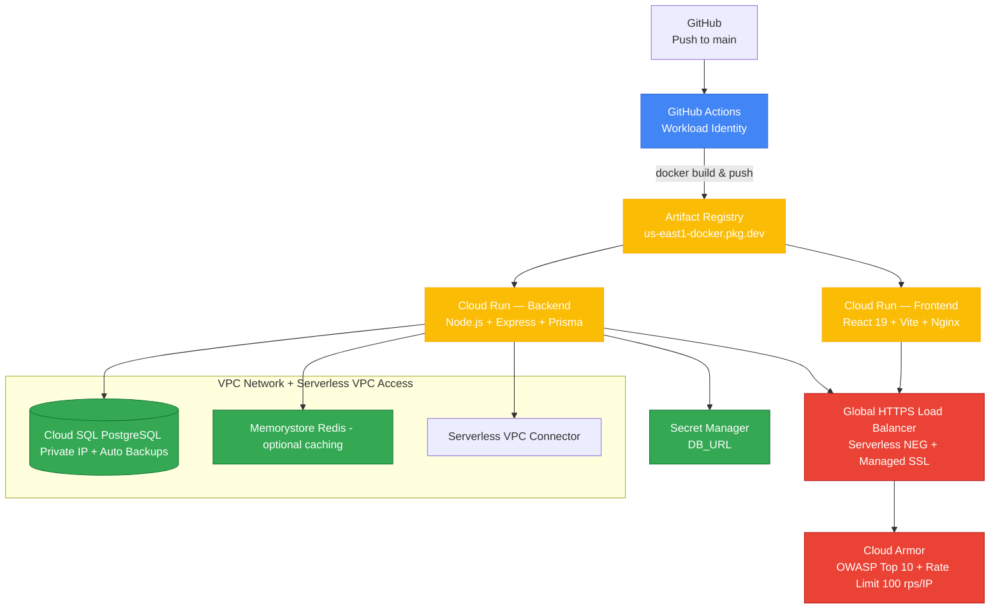

# Spartan Capital — Production-Grade Full-Stack on GCP

**Live Demo** → https://app.luisjorge.dev  
**Source** → github.com/luedev/spartan-capital-gcp-prod

Deployed by **Luis Jorge** — Full-Stack AI/ML + DevOps Engineer

---

## 🏗️ Production Architecture (2025 FinTech Best Practices)



---

## 📋 Table of Contents

- [Features](#features)
- [Local Development](#local-development)
- [Prerequisites](#prerequisites)
- [GCP Deployment](#gcp-deployment)
- [Architecture Details](#architecture-details)
- [Cost Estimation](#cost-estimation)
- [Troubleshooting](#troubleshooting)

---

## ✨ Features

### Application

- **Modern React Dashboard** with real-time portfolio metrics
- **Interactive Charts** using Recharts for performance visualization
- **System Metrics** monitoring (memory, uptime, platform info)
- **Auto-refreshing Data** every 5 seconds
- **Responsive Design** for mobile and desktop

### Infrastructure

- **Serverless Architecture** with Cloud Run (auto-scaling, pay-per-use)
- **Private Database** via VPC with Cloud SQL PostgreSQL
- **Global Load Balancer** with managed SSL certificates
- **Cloud Armor** security policies (OWASP Top 10, rate limiting)
- **Secret Manager** for secure credential storage
- **Terraform** for Infrastructure as Code
- **Multi-stage Docker** builds for optimized images

---

## 🚀 Local Development

### Prerequisites

- Docker & Docker Compose
- Node.js 22+ (optional, for local dev without Docker)

### Quick Start

1. **Clone the repository**

   ```bash
   git clone <repository-url>
   cd spartan_capital_demo
   ```

2. **Start all services**

   ```bash
   docker-compose up
   ```

3. **Access the application**
   - Frontend: http://localhost:5173
   - Backend API: http://localhost:8080
   - Health Check: http://localhost:8080/health

### Local Development (Without Docker)

**Backend:**

```bash
cd backend
npm install
npm run build
npm start
```

**Frontend:**

```bash
cd frontend
npm install
npm run dev
```

---

## ☁️ GCP Deployment

### Prerequisites

1. **GCP Account** with billing enabled
2. **Terraform** >= 1.6 installed
3. **gcloud CLI** installed and authenticated
4. **Docker** for building images
5. **Domain** (optional, for custom SSL certificate)

### Step 1: GCP Project Setup

```bash
# Set your project ID
export PROJECT_ID="your-gcp-project-id"
export REGION="us-east1"

# Enable required APIs
gcloud services enable \
  cloudbuild.googleapis.com \
  run.googleapis.com \
  sqladmin.googleapis.com \
  secretmanager.googleapis.com \
  compute.googleapis.com \
  vpcaccess.googleapis.com \
  artifactregistry.googleapis.com

# Create Artifact Registry repository
gcloud artifacts repositories create spartan-repo \
  --repository-format=docker \
  --location=$REGION \
  --project=$PROJECT_ID
```

### Step 2: Terraform State Bucket

```bash
# Create GCS bucket for Terraform state
gsutil mb -p $PROJECT_ID -l $REGION gs://luisj-terraform-state

# Enable versioning
gsutil versioning set on gs://luisj-terraform-state
```

**Note:** If you use a different bucket name, update `infra/versions.tf` before running `terraform init`.

### Step 3: Build and Push Docker Images

```bash
# Authenticate Docker with Artifact Registry
gcloud auth configure-docker ${REGION}-docker.pkg.dev

# Build and push backend
cd backend
docker build -t ${REGION}-docker.pkg.dev/${PROJECT_ID}/spartan-repo/backend:latest .
docker push ${REGION}-docker.pkg.dev/${PROJECT_ID}/spartan-repo/backend:latest

# Build and push frontend
cd ../frontend
docker build -t ${REGION}-docker.pkg.dev/${PROJECT_ID}/spartan-repo/frontend:latest .
docker push ${REGION}-docker.pkg.dev/${PROJECT_ID}/spartan-repo/frontend:latest
```

### Step 4: Configure Terraform Variables

Create `infra/terraform.tfvars`:

```hcl
project_id = "your-gcp-project-id"
region     = "us-east1"
db_password = "your-secure-database-password"
domain     = "spartan.luisjorge.dev"  # Optional: your domain
```

### Step 5: Deploy Infrastructure

```bash
cd infra

# Initialize Terraform
terraform init

# Review the plan
terraform plan

# Apply the infrastructure
terraform apply
```

**Expected Output:**

- VPC network and subnet
- Cloud SQL PostgreSQL instance (private IP)
- VPC Access Connector
- Secret Manager secret for database URL
- Cloud Run services (backend & frontend)
- Load Balancer with SSL certificate
- Cloud Armor security policy

### Step 6: Configure DNS (If Using Custom Domain)

After deployment, get the load balancer IP:

```bash
terraform output load_balancer_ip
```

Create an A record in your DNS provider:

- **Name:** `spartan` (or `@` for root domain)
- **Type:** `A`
- **Value:** `<load_balancer_ip>`

**Note:** SSL certificate provisioning can take 10-60 minutes. The domain must be accessible via DNS before the certificate can be issued.

### Step 7: Verify Deployment

```bash
# Get the application URL
terraform output url

# Test backend health
curl $(terraform output -raw backend_url)/health

# Test frontend
curl $(terraform output -raw frontend_url)
```

---

## 🏛️ Architecture Details

### Network Architecture

- **VPC Network:** Custom VPC with private subnet (10.0.0.0/20)
- **Private IP:** Cloud SQL uses private IP only (no public access)
- **VPC Connector:** Serverless connector for Cloud Run to access VPC resources
- **Egress:** Cloud Run backend uses `PRIVATE_RANGES_ONLY` to route database traffic through VPC

### Security

- **Cloud Armor:**
  - Rate limiting: 100 requests per 60 seconds per IP
  - Applied to both frontend and backend services
- **Secret Manager:** Database credentials stored securely (Cloud Run automatically gets access via `secret_key_ref`)
- **Private Database:** No public IP, accessible only via VPC
- **SSL/TLS:** Managed SSL certificates for HTTPS

### Compute

- **Cloud Run:**
  - Backend: 1 CPU, 512Mi memory
  - Frontend: Auto-configured (nginx)
  - Auto-scaling: 0 to N instances based on traffic
  - Pay-per-use pricing

### Database

- **Cloud SQL PostgreSQL 15:**
  - Instance: `db-f1-micro` (suitable for demo)
  - Storage: 10GB SSD
  - Backups: Enabled with point-in-time recovery
  - Connection: Unix socket via Cloud SQL Proxy

---

## 💰 Cost Estimation

**Monthly Cost Breakdown (~$10-15/month):**

| Service        | Configuration                        | Estimated Cost            |
| -------------- | ------------------------------------ | ------------------------- |
| Cloud Run      | Backend + Frontend (minimal traffic) | ~$2-5                     |
| Cloud SQL      | db-f1-micro, 10GB SSD                | ~$7-10                    |
| Load Balancer  | Global HTTPS LB                      | ~$18 (first 5 rules free) |
| VPC Connector  | e2-micro, 2-10 instances             | ~$5-10                    |
| Cloud Armor    | Security policy                      | Free tier                 |
| Secret Manager | 1 secret                             | Free tier                 |
| **Total**      |                                      | **~$32-43/month**         |

**Note:** Load balancer has a base cost. For true $10/month, consider:

- Using Cloud Run direct URLs (no load balancer)
- Smaller database instance
- Single-region deployment

**Free Tier Credits:** New GCP accounts get $300 free credits for 90 days.

---

## 🔧 Troubleshooting

### Terraform Issues

**Error: Backend bucket not found**

```bash
# Create the bucket first
gsutil mb -p $PROJECT_ID -l $REGION gs://luisj-terraform-state
```

**Error: API not enabled**

```bash
# Enable all required APIs (see Step 1)
```

**Error: Permission denied**

```bash
# Ensure you have the necessary IAM roles
gcloud projects add-iam-policy-binding $PROJECT_ID \
  --member="user:$(gcloud config get-value account)" \
  --role="roles/owner"
```

### Cloud Run Issues

**Backend can't connect to database**

- Verify VPC connector is running
- Check database connection name in Secret Manager
- Ensure Cloud Run service has VPC access configured

**Images not found**

- Verify images are pushed to Artifact Registry
- Check image path in `cloud-run.tf` matches your repository

### SSL Certificate Issues

**Certificate not provisioning**

- Ensure DNS A record points to load balancer IP
- Wait 10-60 minutes for Google-managed certificate
- Check certificate status in GCP Console

### Local Development

**Port conflicts**

- Change ports in `docker-compose.yml` if 5432, 8080, or 5173 are in use
- Database port conflict: Remove port mapping (containers use service names)

---

## 📚 Additional Resources

- [Cloud Run Documentation](https://cloud.google.com/run/docs)
- [Cloud SQL Documentation](https://cloud.google.com/sql/docs)
- [Terraform GCP Provider](https://registry.terraform.io/providers/hashicorp/google/latest/docs)
- [Cloud Armor Best Practices](https://cloud.google.com/armor/docs/security-policy-concepts)

---

## 📝 License

MIT License - See LICENSE file for details

---

**Built with ❤️ by Luis Jorge**
